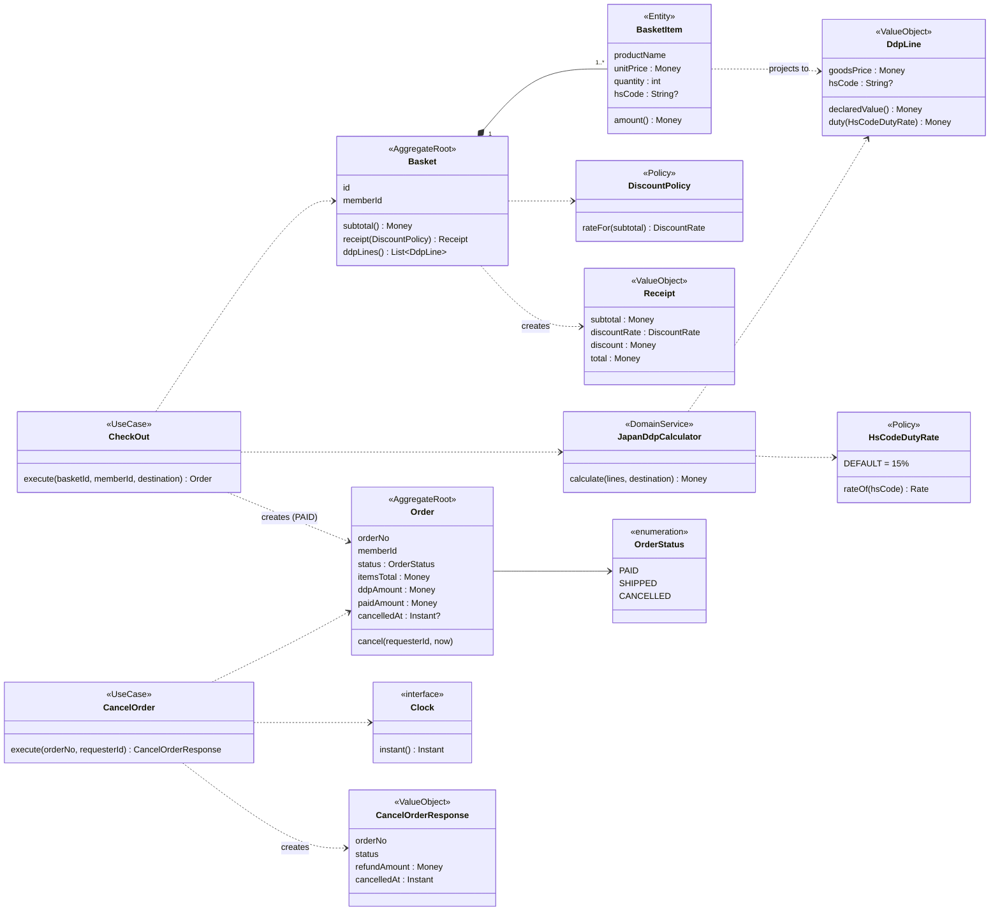
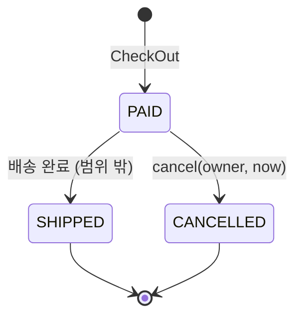
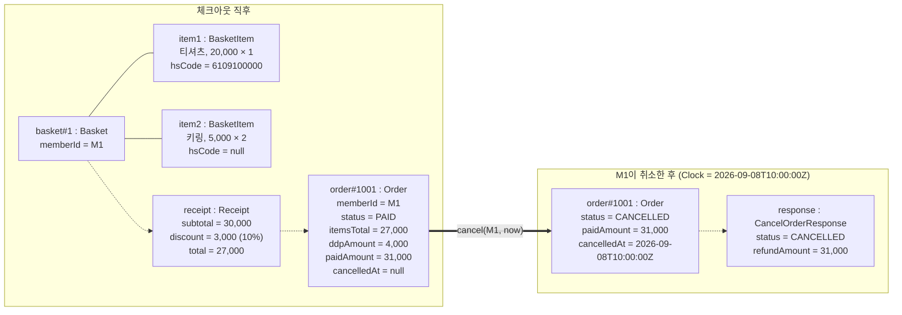

# 통합 도메인 모델 — Shopping Basket · Japan DDP · Cancel Order

상태: 초안. `[가정]` 표시는 원천 자료에 없는 연결 지점이다. §6의 1~3은 2026-10-01 확정, 4는 미확정.

## 1. 원천 자료

| 도메인 | 원천 | 가져온 규칙 |
|---|---|---|
| Shopping Basket | `msbaek/tdd-workshop` PR #4 (`CreateShoppingBasket`, `Basket`, `BasketItem`) | 라인 = (상품명, 단가, 수량). 소계 구간 할인. 빈 장바구니 거부. 영수증 |
| Japan DDP | `japan-ddp-v2-spec.md` §4~§6, `JapanDdpCalculator` | 라인별 신고가액·관세 → 주문 합산 소비세·지방소비세 → 100엔 절사 합 |
| Cancel Order | `order-cancel-plan-input.md`, `CancelOrder.feature`, `Order.java` | `PAID → CANCELLED`, 검증 순서, 환불 요청액 = 결제액 |

## 2. 용어

| 용어 | 정의 | 출처 |
|---|---|---|
| 장바구니(Basket) | 회원이 담은 라인의 집합. 주문 전환 전 단계 | PR #4 |
| 라인(BasketItem) | 상품 1종의 (상품명, 단가, 수량, HScode) | PR #4 + DDP |
| 라인 금액(line amount) | 단가 × 수량. DDP의 할인가(goodsPrice)와 같은 값 `[가정]` | PR #4, DDP §2 |
| 소계(subtotal) | 라인 금액의 합 | PR #4 |
| 구간 할인(tier discount) | 소계 구간으로 정하는 주문 단위 할인. 20,000 이상 10%, 10,000 초과 5%, 그 외 0% | PR #4 |
| 상품 결제액(total) | 소계 − 구간 할인 | PR #4 |
| DDP 세액 | 관세 + 소비세 + 지방소비세. 일본 배송 주문에만 부과 | DDP §2 |
| 결제액(paidAmount) | 상품 결제액 + DDP 세액 `[가정]`. 항상 0보다 크다 | Cancel §2 |
| 환불 요청액 | 취소 성공 시 결제액과 같은 값 | Cancel §2 |

용어 충돌 2건:

- **할인**: Basket의 "할인"은 주문 단위 구간 할인이다. DDP의 "할인가"는 상품쿠폰 반영 금액이며 주문 단위 할인을 반영하지 않는다(DDP §2). 두 개념을 `구간 할인` / `라인 금액`으로 분리한다.
- **Line**: DDP `Line(goodsPrice, hsCode)`와 `BasketItem(name, price, quantity)`은 같은 대상의 다른 투영이다. `BasketItem`에 `hsCode`를 추가하고 DDP 입력은 `BasketItem`에서 파생한다.

## 3. 주요 사용자 스토리

| # | 스토리 | 핵심 규칙 |
|---|---|---|
| US-1 | 상품을 담은 회원으로서, 구간 할인이 반영된 영수증을 보고 싶다. 결제 전에 부담액을 알기 위해 | 소계 ≥ 20,000 → 10%. 10,000 < 소계 < 20,000 → 5%. 소계 ≤ 10,000 → 0%. 빈 장바구니는 영수증 거부 |
| US-2 | 일본 배송 회원으로서, 체크아웃 시 확정 DDP 세액을 미리 보고 싶다. 통관 시 추가 청구를 받지 않기 위해 | 라인 금액 합 > 16,666엔일 때만 과세. 배송비 제외. HScode별 관세율, 미매핑·null은 15% |
| US-3 | 구매를 결정한 회원으로서, 장바구니를 주문으로 확정하고 싶다. 영수증에서 본 금액 그대로 결제하기 위해 `[가정]` | 결제액 = 상품 결제액 + DDP 세액. DDP 세액은 주문에 확정 값으로 저장 |
| US-4 | 결제를 마친 회원으로서, 배송 완료 전 자기 주문을 전체 취소하고 싶다. 결제액 전액을 돌려받기 위해 | `PAID`만 취소 가능. 환불 요청액 = 결제액(DDP 포함). 취소 시각 = Clock 값 |
| US-5 | 결제를 마친 회원으로서, 배송됐거나 이미 취소된 주문이 잘못 취소되지 않기를 원한다. 주문 상태가 예상 밖으로 변경되지 않도록 | 검증 순서: 형식(400) → 없음(404) → 권한(403) → 상태(409). 거부 시 변경 없음 |

## 4. 클래스 다이어그램



설계 결정:

- **Aggregate 2개**: `Basket`(라인 소유)과 `Order`(상태·금액 소유). `Order`는 `Basket`을 참조하지 않는다. 체크아웃 시점 금액을 값으로 복사한다(DDP §10-4: 확정 관세는 주문에 저장).
- **`Order`에 라인 없음**: 취소는 항상 전체 취소이며 환불 요청액은 `paidAmount`만으로 결정된다.
- **`JapanDdpCalculator`는 순수 계산**: 상태·협력 객체 없음. 일본 배송이 아니면 0.
- **`DiscountPolicy` 분리**: PR #4에서 컨트롤러에 있는 구간 분기를 정책 객체로 이동한다.
- **상태 전이**: `PAID → SHIPPED`, `PAID → CANCELLED`만 존재한다.



## 5. 객체 다이어그램 — 세 규칙이 한 주문에서 만나는 예

입력: 회원 M1, 일본 배송, 티셔츠 20,000 × 1 (HS 6109100000, 10%) + 키링 5,000 × 2 (HS 없음, 15%).

검산:

```
소계        = 20,000 + 10,000                         = 30,000
구간 할인   = 30,000 × 10%  (소계 ≥ 20,000)            =  3,000
상품 결제액 = 30,000 − 3,000                           = 27,000

신고가액    = 12,000 + 6,000                           = 18,000
Σ관세       = 12,000 × 0.10 + 6,000 × 0.15             =  2,100
과세표준    = 18,000 + floor100(2,100)                 = 20,100
소비세      = floor1000(20,100) × 0.078                =  1,560
지방소비세  = floor100(1,560) × 22/78                  =    423
DDP         = 2,100 + 1,500 + 400                      =  4,000   (DDP spec §6 B-3과 동일)

결제액      = 27,000 + 4,000                           = 31,000
환불 요청액 = 결제액                                    = 31,000
```



## 6. 결정 및 미확정 사항

| # | 질문 | 채택한 값 | 다른 값이면 달라지는 것 | 상태 |
|---|---|---|---|---|
| 1 | DDP 과세 기준에 구간 할인을 반영하는가 | 반영하지 않음 — 라인 금액 기준 (DDP §2 "주문 단위 쿠폰 미반영") | 반영하면 구간 할인을 라인에 배분하는 규칙이 추가로 필요하다. §5 예제의 DDP 값이 변경된다 | 확정 |
| 2 | 통화 | 단일 통화. 금액 단위를 구분하지 않는다 (PR #4는 원, DDP는 엔) | 통화를 구분하면 `Money`에 통화가 추가되고 DDP 입·출구 환산(DDP §7)이 모델에 포함된다 | 확정 |
| 3 | `CheckOut`(Basket → Order 전환) 포함 여부 | 포함 — 세 원천 자료를 연결하는 유일한 지점이며 원천 자료에는 없다 | 제외하면 세 모델은 서로 독립이고 `Order.paidAmount`는 주어진 값이다 | 확정 |
| 4 | 라인 금액 = 단가 × 수량을 DDP `goodsPrice`로 쓰는가 | 사용 — 신고가액 반올림은 라인 단위 | 개당 계산이면 수량이 2 이상인 라인의 반올림 결과가 달라진다 | 미확정 |

## 7. 범위 밖

- DDP 게이팅 중 feature flag, 대상 상점(JP/COM), 환율 조회, V1 폴백
- 부분 취소, 재고·쿠폰·마일리지 복원, PG 환불 호출, 동시 취소
- 배송비, 상품쿠폰, 재고 검증, 결제 수단
